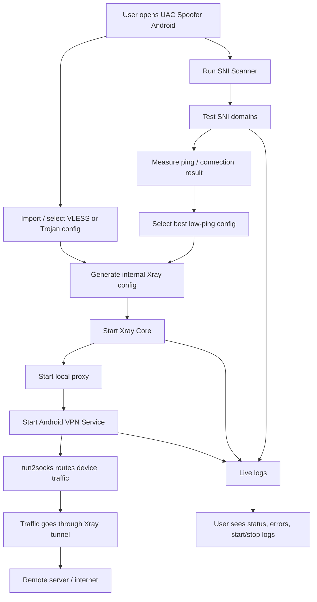

# UAC Spoofer Android

<div align="center">

[](https://github.com/user-attachments/assets/08c9b44d-204f-405f-965f-2f973a9addfa)

</div>




این پوشه شامل پروژه اصلی Android برنامه UAC Spoofer است. برنامه با Java و Android Gradle Plugin ساخته شده و برای اجرای کانفیگ‌های VLESS و Trojan، راه‌اندازی Xray، ایجاد VPN tunnel محلی و مدیریت SNI Spoofing استفاده می‌شود.

## اجزای اصلی

- `MainActivity`: رابط کاربری، مدیریت کانفیگ‌ها، scanner، لاگ‌ها و کنترل run/stop.
- `ProxyService`: سرویس foreground برای proxy، مدیریت اتصال‌ها، failover و وضعیت runtime.
- `XrayRunner`: اجرای Xray Core و تولید config داخلی.
- `TProxyService`: سرویس VPN و tun2socks.
- `SniSpoofScanner`: اسکن دامنه‌های SNI و تولید نتایج قابل اعمال.
- `jniLibs`: باینری‌های native برای `arm64-v8a` و `x86_64`.

## قابلیت‌های برنامه

- اسکن SNI از لیست دامنه‌های داخلی.
- انتخاب خودکار بهترین کانفیگ بر اساس ping پایین‌تر.
- اجرای کانفیگ‌های VLESS و Trojan با Xray داخلی.
- نمایش لاگ زنده برای start، stop، Xray، VPN و خطاها.
- لینک پشتیبانی تلگرام: `@Beh50roocentzuac`.

## Build

```powershell
.\gradlew.bat assembleDebug
.\gradlew.bat assembleRelease
```

خروجی release:

```text
app/build/outputs/apk/release/app-release.apk
```

## Signing

فایل‌های signing واقعی در repository عمومی قرار نمی‌گیرند. برای ساخت release امضاشده، `signing.properties.example` را به `signing.properties` تبدیل کنید و مقادیر محلی خود را وارد کنید.

```text
signing.properties
*.jks
```

این فایل‌ها توسط `.gitignore` حذف شده‌اند و نباید commit شوند.

## License

این پروژه فقط با ذکر منبع قابل ادامه دادن، fork کردن یا انتشار نسخه تغییر یافته است. استفاده از پروژه با نام خودتان، حذف credit، rebrand کردن و بازنشر تجاری بدون اجازه ممنوع است. متن کامل در فایل `../LICENSE` قرار دارد.
