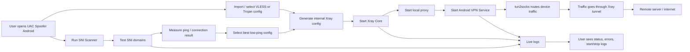

# UAC Spoofer Android

<div align="center">

[](https://github.com/user-attachments/assets/08c9b44d-204f-405f-965f-2f973a9addfa)

</div>




این پوشه شامل پروژه اصلی Android برنامه UAC Spoofer است. برنامه با Java و Android Gradle Plugin ساخته شده و برای اجرای کانفیگ‌های VLESS و Trojan، راه‌اندازی Xray، ایجاد VPN tunnel محلی و مدیریت SNI Spoofing استفاده می‌شود.

## اجزای اصلی

## قابلیت‌های برنامه

* اسکن SNI از لیست دامنه‌های داخلی.
* انتخاب خودکار بهترین کانفیگ بر اساس کمترین Ping و نتیجه اتصال.
* اجرای کانفیگ‌های VLESS و Trojan با Xray داخلی.
* پشتیبانی از **Split Tunneling** برای انتخاب اینکه فقط برنامه‌های مشخص از داخل تونل عبور کنند.
* پشتیبانی از **Dark Mode / Light Mode** برای شخصی‌سازی ظاهر برنامه.
* نمایش لاگ زنده برای Start، Stop، Xray، VPN و خطاها.
* مدیریت VPN محلی و هدایت ترافیک از طریق tun2socks.
* لینک پشتیبانی تلگرام: `@Beh50roocentzuac`


## قابلیت‌های برنامه

- اسکن SNI از لیست دامنه‌های داخلی.
- انتخاب خودکار بهترین کانفیگ بر اساس ping پایین‌تر.
- اجرای کانفیگ‌های VLESS و Trojan با Xray داخلی.
- نمایش لاگ زنده برای start، stop، Xray، VPN و خطاها.
- لینک پشتیبانی تلگرام: `@Beh50roocentzuac`.

## Build

```powershell
.\gradlew.bat assembleDebug
.\gradlew.bat assembleRelease
```

خروجی release:

```text
app/build/outputs/apk/release/app-release.apk
```

## Signing

فایل‌های signing واقعی در repository عمومی قرار نمی‌گیرند. برای ساخت release امضاشده، `signing.properties.example` را به `signing.properties` تبدیل کنید و مقادیر محلی خود را وارد کنید.

```text
signing.properties
*.jks
```

## نکته نصب

⚠️ این APK دارای سرتیفیکت (امضای انتشار) نیست.

ممکنه موقع نصب فایل **Release** در بعضی دستگاه‌ها هشدار:

**«Harmful app blocked»**

نمایش داده بشه.

در این حالت:

← روی **More details** بزنید
← سپس **Install anyway** رو انتخاب کنید

این هشدار به‌خاطر منتشر نشدن برنامه از طریق پلی‌استور یا نداشتن امضای انتشار نمایش داده می‌شود.

## License

این پروژه فقط با ذکر منبع قابل ادامه دادن، fork کردن یا انتشار نسخه تغییر یافته است. استفاده از پروژه با نام خودتان، حذف credit، rebrand کردن و بازنشر تجاری بدون اجازه ممنوع است. متن کامل در فایل `../LICENSE` قرار دارد.
