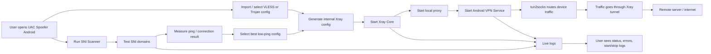

# UAC Spoofer Android


<div align="center"> <a href="https://github.com/user-attachments/assets/c21aa295-8786-4494-bb77-6765bff43afd">  </a> <a href="https://github.com/user-attachments/assets/6029401d-e02b-449e-a70b-a13575628db4">  </a> <a href="https://github.com/user-attachments/assets/c4251fc7-796f-447e-b7df-9cf4ac2d46d0">  </a> <a href="https://github.com/user-attachments/assets/68206bcd-d913-4cda-87a8-cc935c2b141c">  </a> <a href="https://github.com/user-attachments/assets/9d244d7e-4bb7-4ec5-807e-f4738a372ba2">  </a> </div>

<br> <br>




این پوشه شامل پروژه اصلی Android برنامه UAC Spoofer است. برنامه با Java و Android Gradle Plugin ساخته شده و برای اجرای کانفیگ‌های VLESS و Trojan، راه‌اندازی Xray، ایجاد VPN tunnel محلی و مدیریت SNI Spoofing استفاده می‌شود.


## قابلیت‌های برنامه

* اسکن SNI از لیست دامنه‌های داخلی.
* انتخاب خودکار بهترین کانفیگ بر اساس کمترین Ping و نتیجه اتصال.
* اجرای کانفیگ‌های VLESS و Trojan با Xray داخلی.
* پشتیبانی از **Split Tunneling** برای انتخاب اینکه فقط برنامه‌های مشخص از داخل تونل عبور کنند.
* پشتیبانی از **Dark Mode / Light Mode** برای شخصی‌سازی ظاهر برنامه.
* نمایش لاگ زنده برای Start، Stop، Xray، VPN و خطاها.
* مدیریت VPN محلی و هدایت ترافیک از طریق tun2socks.
* اضافه شدن قابلیت انتخاب تم فارسی / English برای شخصی‌سازی ظاهر برنامه.
* ### تنظیمات پیشرفته / Tuning

 بخش Advanced / Tuning اضافه شده تا کاربر بتواند بین سرعت و پایداری عبور از فیلترینگ تعادل ایجاد کند.

- **Mode / حالت**
  - **Fast**: اولویت با سرعت است. روش‌های سبک‌تر را زودتر تست می‌کند. ممکن است روی بعضی اپراتورها جواب ندهد.
  - **Balanced**: حالت پیش‌فرض. رفتار پایدار قبلی را حفظ می‌کند و بین سرعت و پایداری تعادل دارد.
  - **Stealth**: حالت مخفی‌کارانه‌تر و قوی‌تر برای عبور از DPI. کندتر است ولی روی شبکه‌های سخت‌گیرتر احتمال موفقیت بیشتری دارد.
  - **Custom**: کاربر می‌تواند همه پارامترهای bypass را دستی تنظیم کند.

* لینک پشتیبانی تلگرام: https://t.me/Beh50roocentzuac
* لینک کانال تلگرام:https://t.me/UacSniSpoofer

## Build

```powershell
.\gradlew.bat assembleDebug
.\gradlew.bat assembleRelease
```

خروجی release:

```text
app/build/outputs/apk/release/app-release.apk
```

## Signing

فایل‌های signing واقعی در repository عمومی قرار نمی‌گیرند. برای ساخت release امضاشده، `signing.properties.example` را به `signing.properties` تبدیل کنید و مقادیر محلی خود را وارد کنید.

```text
signing.properties
*.jks
```

## نکته نصب

  اگر هنگام نصب APK با هشدار: ****«Unknown app»** مواجه شدید: 1. روی **More details** بزنید. 2. گزینه **Install anyway** را انتخاب کنید. 3. نصب برنامه را ادامه دهید. > در برخی دستگاه‌های اندرویدی هنگام نصب مستقیم فایل APK (خارج از Google Play) این هشدار نمایش داده می‌شود.

## License
این پروژه فقط با ذکر منبع قابل ادامه دادن، Fork کردن یا انتشار نسخه تغییر یافته است. استفاده از پروژه با نام خودتان، حذف Credit، Rebrand کردن و بازنشر تجاری بدون اجازه ممنوع است. متن کامل در فایل `LICENSE` قرار دارد.

این پروژه فقط با ذکر منبع قابل ادامه دادن، fork کردن یا انتشار نسخه تغییر یافته است. استفاده از پروژه با نام خودتان، حذف credit، rebrand کردن و بازنشر تجاری بدون اجازه ممنوع است. متن کامل در فایل `../LICENSE` قرار دارد.
